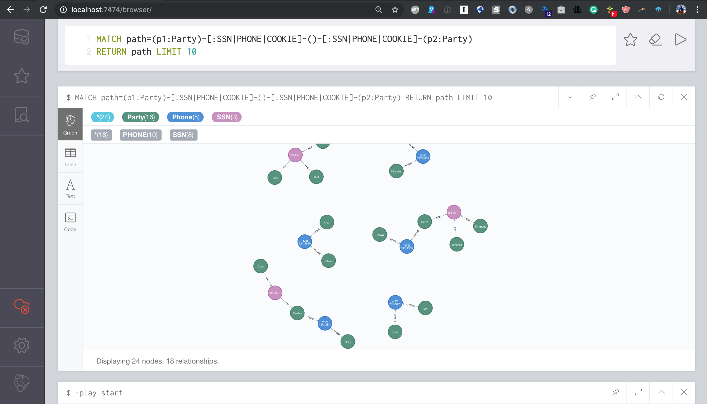

# kafka-summit-fraud-demo

This repo holds an example dataset that implements the first-party fraud model taken from a large
banking institution.   All of the data is faked by a script, no SSNs or actual names/PII is used.

## Setup

* `git submodule init`
* `git submodule update`
* `cd fakestream && pipenv install`

## Needed Kafka Topics

Ensure at least the following topics exist:

* cookies
* fraudflags


## Starting Neo4j / Neo4j-Streams

In the `neo4j-streams` subdirectory:

* Create an `.env` file with `KAFKA_BOOTSTRAP_SERVERS`, `CONFLUENT_API_KEY`, `CONFLUENT_API_SECRET` pointing to a Confluent Cloud instance
* `./run.sh`

This will expand the pre-cooked dataset that's populated with base data and
fraud rings, and start Neo4j with streams enabled.

## Loading the data

In the `cypher` subdirectory:

Use `run-all.sh` - edit the URL and password for the Neo4j connection and just run the script.  This 
will load a default dataset and create some sample fraud rings.

## Starting the Back-End

In the `dashboard/api` subdirectory:

* Create a `.env` file with these settings: (this assumes you're using docker-compose above)

```
NEO4J_URI=bolt://localhost
NEO4J_USER=neo4j
NEO4J_PASSWORD=admin
BLOOM_BASE_URL=http://localhost:7474/browser/bloom?perspective=Fraud&search=
```

* `npm install`
* `npm start`

## Starting the Front-End

In the `dashboard/ui` subdirectory:

* Create a `.env` file with `REACT_APP_GRAPHQL_URI=http://localhost:4001`
* `npm install`
* `npm start`

## Simulating Kafka Flow Messages

In the `fakestream` directory:

* `export KAFKA_BOOTSTRAP_SERVERS=<your Kafka bootstrap servers here>`
* `export CONFLUENT_API_KEY=<your Confluent API key here>`
* `export CONFLUENT_API_SECRET=<your Confluent API secret here>`
* `pipenv run python3 fake.py --topic cookies --template scenarios/financial-fraud/resources/cookie.json --mps 1 -n 10000`

(Alter the "template" argument and "topic" arguments as necessary)

## Querying The GraphQL API

GraphQL Playground allows you to query the API using GraphQL from a web-browser. Open a web-browser and navigate to `http://localhost:4001/graphql` to open GraphQL Playground. You should see something like this:


### Interesting GraphQL Queries

*Find an unadjudicated case*

```GraphQL
{
  Party(
    filter: { case_id_not: "", 
              fraud_followup: true, 
              fraud_confirmed: true }
    first: 1
  ) {
    last_name
    sharedIdentitySize
    sharedIdentity {
      last_name
      address {
        address
      }
      account {
        iban
        currency
      }
    }
  }
}
```

## Import The Fraud Bloom Perspective

Neo4j Bloom allows an analyst to explore data in Neo4j without writing Cypher queries.

* Open Bloom at `http://localhost:7474/browser/bloom`
* Select the Settings tab and enable "Experimental features"
* Select the Experiment Features tab (looks like a beaker)
* Choose "Import Perspective" and choose `dashboard/bloom/perspective.json`


## Using The Dashboard Frontend

The dashboard web application allows fraud analysts to investigate potentially fraudulent cases and parties and adjudicate the case using graph visualization. 

Open a web-browser and navigate to `http://localhost:3000`. You should see something like this:


## Interesting Cypher Queries

*Find parties with overlapping bits of identity*

```cypher
MATCH path=(p1:Party)-[:SSN|PHONE|COOKIE]-()-[:SSN|PHONE|COOKIE]-(p2:Party)
RETURN path LIMIT 10
```




*Find Fraud Rings*

```cypher
MATCH path=(p1:Party)-[:SSN|PHONE|COOKIE]-()-[:SSN|PHONE|COOKIE]-(p2:Party)-[*..2]-()--(:Party)
RETURN path LIMIT 100
```

